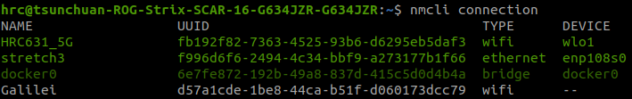

# 3-3. SSH over ETH {data-status="done"}

> 沒有 router 的場景中，使用 Ethernet 實體連線通訊是最直接穩定的方式。  

??? Note "FYI"
    下方紀錄使用場景為：``` Linux Host OS --- ETH --- Linux Robot (Stretch 3) ```

## 3-1. procedure

> 與 Wi-Fi SSH 流程幾乎相同，只差在要手動設定靜態 IP。

1. Connect two Linux devices via Ethernet.
2. Set static IP addresses.
3. Enable SSH.
4. Connect using VSCode's Remote SSH extension.

## 3-2. static IP setup

> 插入乙太網路後，透過 `nmcli` 設定靜態 IP。

1. 檢查連線狀態：`sudo nmcli connection` 。
    
    幾點注意：
    
    
    * 每行列出項目為一網路連線的設定，UUID 是各規則的唯一識別碼。
    * 綠色表正在使用；白灰色為已儲存，但目前沒被使用的規則。
    * ETH 實體連線時會套用已存在規則。    
    若不存在 ETH 規則會自動創建，通常是 `Wired connection 1`。

    ??? info "example"

        

2. 分別修改 local host 和 remote host 的規則，以設定雙方 IP 位址。  
   設定完後請 `ping` 彼此的 IP 測試連線。
    
    * local host (192.168.10.1)
        ```
        sudo nmcli connection modify <name> \
          ipv4.method manual \
          ipv4.addresses 192.168.10.1/24 \
          ipv4.gateway ""
        nmcli connection up
        ```

    * remote host (192.168.10.2)
        ```
        sudo nmcli connection modify <name> \
          ipv4.method manual \
          ipv4.addresses 192.168.10.2/24 \
          ipv4.gateway ""
        nmcli connection up
        ```

至此即設定完成，其餘 SSH 基本操作省略。  


## 3-3. common commands

以下是一些 `nmcli` 其他常見功能。

1. 修改規則名稱。  
  ```
  sudo nmcli connection modify <old-name> connection.id <new-name>
  ```

    ??? info "example"

        

2. 顯示規則。  
  ```
  sudo nmcli connection show <name>
  ```

3. 切換規則。
   ```
   nmcli connection up <name> iface <eth_interface>
   ```

    ??? info "example"

        ```
        nmcli connection up stretch3 iface eth0
        ```
